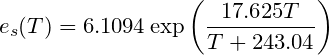
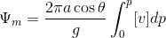

# Lab exercises 
### 1st lab session (9 Jan 2019)

Please submit the following exercise:

1. List and Dictionaries

   Put your name and year of study in a **list**. Use the `print()` function to print `My name is ` followed by your name and a full stop `.`. On the same line, print `I am a year ` followed by your year of study, and ` student.`. 

   Sample output:
   ``` 
   My name is Joey. I am a year 1 student.
   ```
   Now put your name and year of study in a **dictionary**. Use the `print()` function to generate the same output.

1. Functions and Calculations

   Define a function for the following formula, which calculates the saturation vapor pressure of a temperature:

   

   It is given that the air temperature is now 18 degree Celsius and the dew point temperature is 13.5 degree Celsius, find the relative humidity (in %). Use the `print()` function to print `The relative humidity is ` followed by your answer and the percentage sign `%` and a full stop `.`. 

   Sample output:
   ``` 
   The relative humidity is 30.1%.
   ```
   Optional: Learn to use `format()` to limit the output of your answer to one decimal place.

You may submit your answers in .ipynb or .py format on Blackboard. Make sure you name your file in a meaningful way and don't leave any space(s) in the file name. (I don't want to receive something like "Untitled.ipynb", or "a.py")

### 2nd lab session (14 Jan 2019)

You are not required to submit today's exercises.

1. Function and if statement

   Define a function to calculate the potential temperature from actual temperature (in degree Celsius, remember you need to convert it into Kelvin) and pressure (in hPa). Use if statements (if/elif/else) to reject any of the following scenarios:
   1. Input pressure is negative;
   2. Input pressure is larger than 10000hPa;
   3. Input actual temperature is smaller than -273.15 degree Celsius.
   
   Under the if statements, you can either print an error message, displaying the corresponding scenarios listed above, or use error handling tools in Python (e.g. raise ValueError('*error_message*') ). Learn more about error handling here: [Python Exceptions: An Introduction – Real Python](https://realpython.com/python-exceptions/)

2. While loop

   Construct a while loop to divide a number of your choice, e.g. 1.4, by 2 by many times until it becomes smaller than 0.00001.
   
   Note: this is part of the bisection method, which is a simple numerical method of solving an equation.

### 3rd lab session (16 Jan 2019)

Please submit the following exercise:

1. NetCDF file handling and Plotting on a map

   Using the sample_data.nc, plot a map of 500hPa daily average **potential temperature** on 11 June 2017. You may want to reuse part of the function you have written in exercise 1 of [2nd lab session](./Exercise.md#2nd-lab-session-14-jan-2019). Make sure you take care of the units correctly. Also make sure you include a title and axis titles with units in your plot and save it as png file.
   
   You are required to submit your answers in .py or .ipynb format, and also your plot in .png format.
   
### 4th lab session (23 Jan 2019)

Please submit the following exercise:

1. Hadley cell

   Plot the meridional mass streamfunction **for each month** using the given climatology monthly mean v-wind. The y-axis should be pressure level and x-axis should be latitude.
   
   By taking average over different months, **also** plot the climatology **annual mean** meridional mass streamfunction. 
   
   Make sure you include a title, axis titles and a color bar (if applicable) in your plot and save it as png file.
   
   You are required to submit your answers in .py or .ipynb format, and also your plots (13 plots in total) in .png format.
   
   Hint: 
   - The formula of integration is
   
     
   
   - You may want to use `xr.concat()` (in *xarray* library) to add a reference v-wind at pressure level *p=0*. This allows the data to be integrated from 0 to a specific pressure level.
   - `cumtrapz()` in the library `scipy.integrate` is helpful in doing *cumulative* integration using data samples.
   - You may invert the y-axis by using larger values for *ymin* and smaller values for *ymax*:
     ```
     plt.axis([xmin,xmax,ymin,ymax])
     ```
   - Let me know if you have any specific idea on how the plot should look! Perhaps I can help.
   

   
