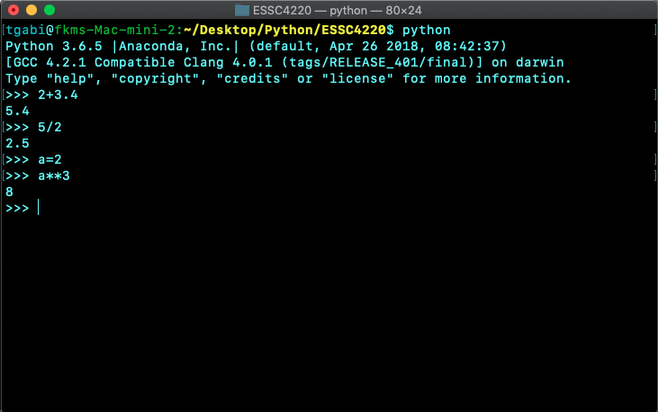
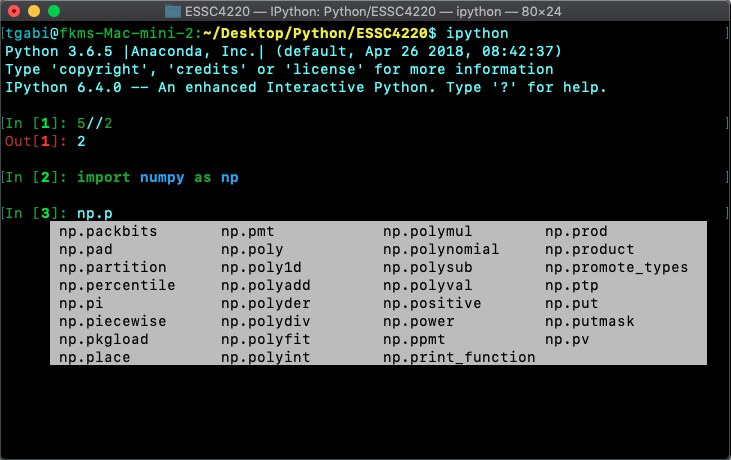
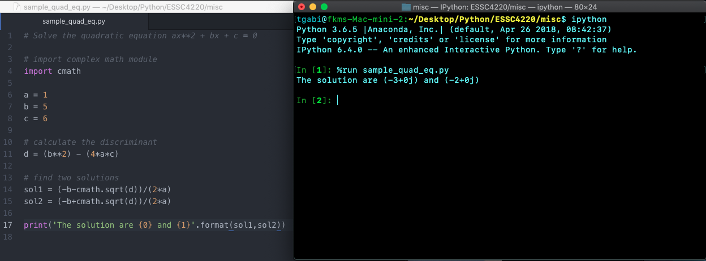
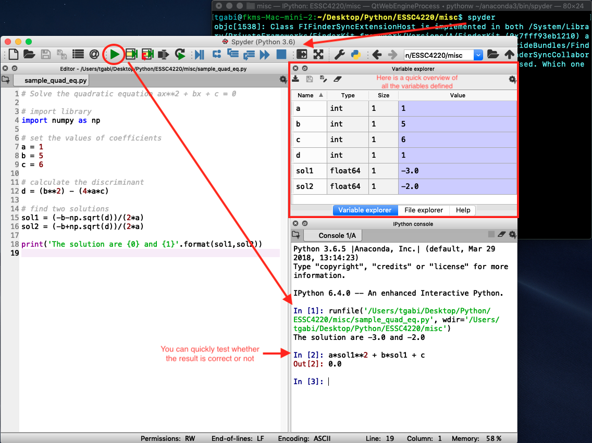
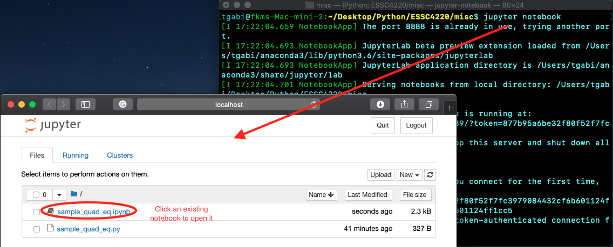
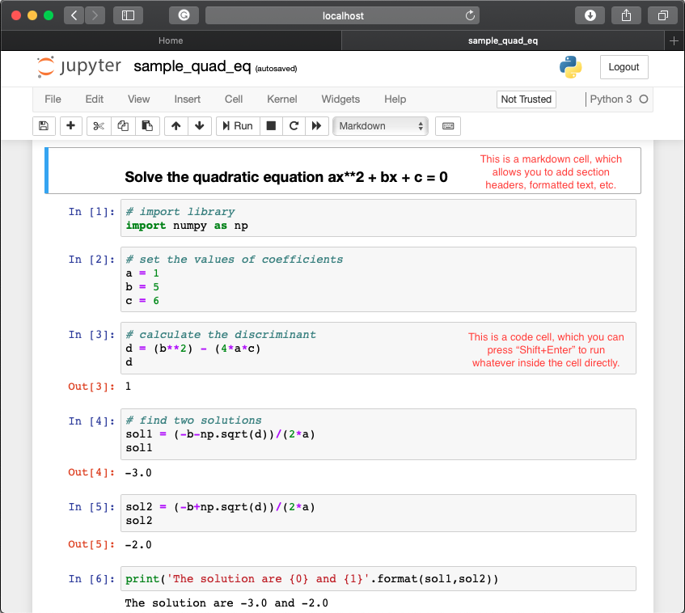

# Python Introduction

#### Objective: You want to tell the computer to do something. It can be as simple as adding two numbers, but also as complicated as plotting, making a video, doing an operation a million times, etc.

With a programming *language* like Python, you can *communicate* with the computer relatively easily (compared to using only 1 and 0).

Why should you use a programming language, not a software? 
1. General Purpose: A programming language is more flexible while a software is designed to accomplish a specific task with ease. Ease of use and flexibility is always a tradeoff.
1. Repeatibility: If we have to repeat a task many times (maybe with minor variations), then programming can be faster.

Why Python?
- High-level programming language: No compilation needed, well-developed Integrated Development Environments (IDEs) to make coding and testing easier.
- Open source and free: There's no license, and most libraries and IDEs are free and open to public.
  - Popular: Also means you would find the answers to most problems/questions online :)
  - Many libraries: Libraries help you accomplish tasks easier. 
- General Purpose: It can accomplish different kinds of task, and thus is used by people from different industries, e.g. backend web development, data analysis, artificial intelligence, scientific computing, etc.
- Beginner friendly: Syntax are easy to learn, and can be read like English.

### Operation modes
If you just want to do some quick testing or very simple operations, you may just use **command-line mode**. On the other hand, **script mode** is for writing, saving and editing longer scripts that you have typed. However, as a good IDE, it is essential to have both so that users can easily test easily as they write.

#### Command-line mode
By typing `python` in terminal (for Mac)/Anaconda prompt (for Windows), you will enter the default python command-line interface (CLI):

Alternatively, type `ipython` in terminal (for Mac)/Anaconda prompt (for Windows), you will enter an interactive python CLI: (which enables auto-complete, colored syntax, etc. capabilities)

#### Script mode
In the following example, I wrote a short script on the left, and run it using the `ipython` CLI.

#### Mixed mode
As mentioned, good IDEs should have both modes. One example is *Spyder*. You can type `spyder` in terminal (for Mac)/Anaconda prompt (for Windows) to open it. 

A more CLI-like example is *Jupyter*. You can type `jupyter notebook` in terminal (for Mac)/Anaconda prompt (for Windows) to open it.

*Note: To close Jupyter, close the web browsers and press `Ctrl+C` twice in terminal (for Mac)/Anaconda prompt (for Windows).*

