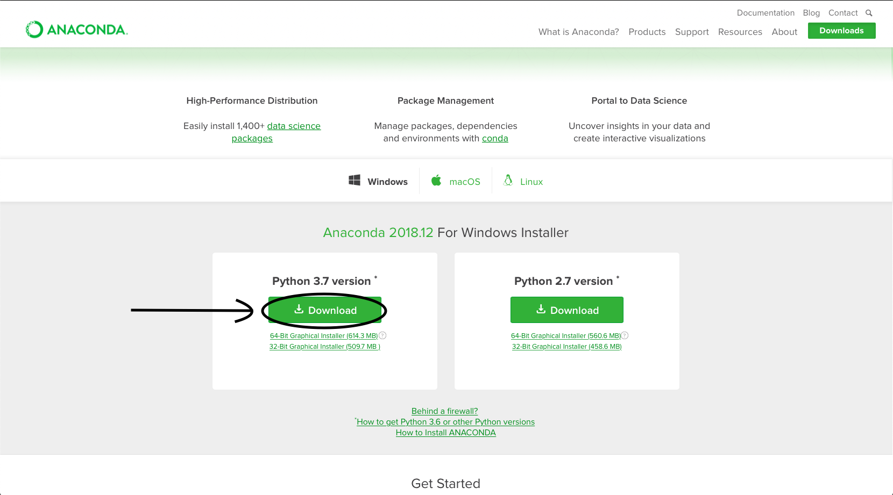

# How to install Anaconda on Mac?

#### Go to https://www.anaconda.com/download/#windows and download Python 3.7 version.

Anaconda is a popular platform to Python (and R) data science. It comes with several IDEs (Integrated Development Environments, such as Jupyter and Spyder) and a package manager (conda) to allow user-friendly coding with Python.

*NOTE: To prevent permission errors, do not launch the installer from the Favorites folder.*

*NOTE: If you encounter issues during installation, temporarily disable your anti-virus software during install, then re-enable it after the installation concludes. If you installed for all users, uninstall Anaconda and re-install it for your user only and try again.*
<p align="center">
  
</p>

#### You can continue with the default options. The installation takes around 10 minutes.
<p align="center">
  
</p>

<p align="center">
  
</p>


#### No need to install Microsoft Visual Studio at the end. We won't use it in this lab.
<p align="center">
  
</p>

#### A successful installation displays the following screen:
<p align="center">
  
</p>

#### Now use the conda command prompt to verify installation and find the path of the required stuffs.
<p align="center">
  
</p>
<p align="center">
  
</p>

#### Type/copy the following commands into the conda command prompt:

```
where python
where conda
where jupyter
where spyder
```
