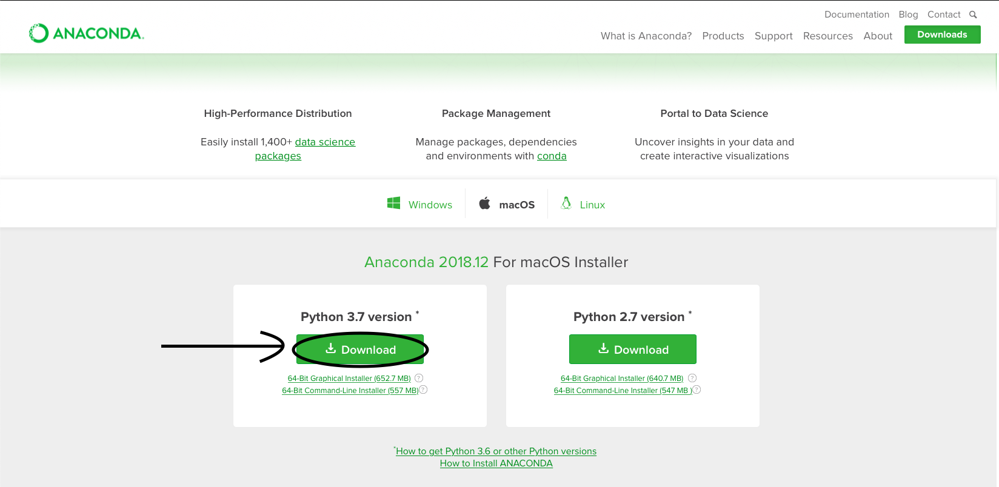
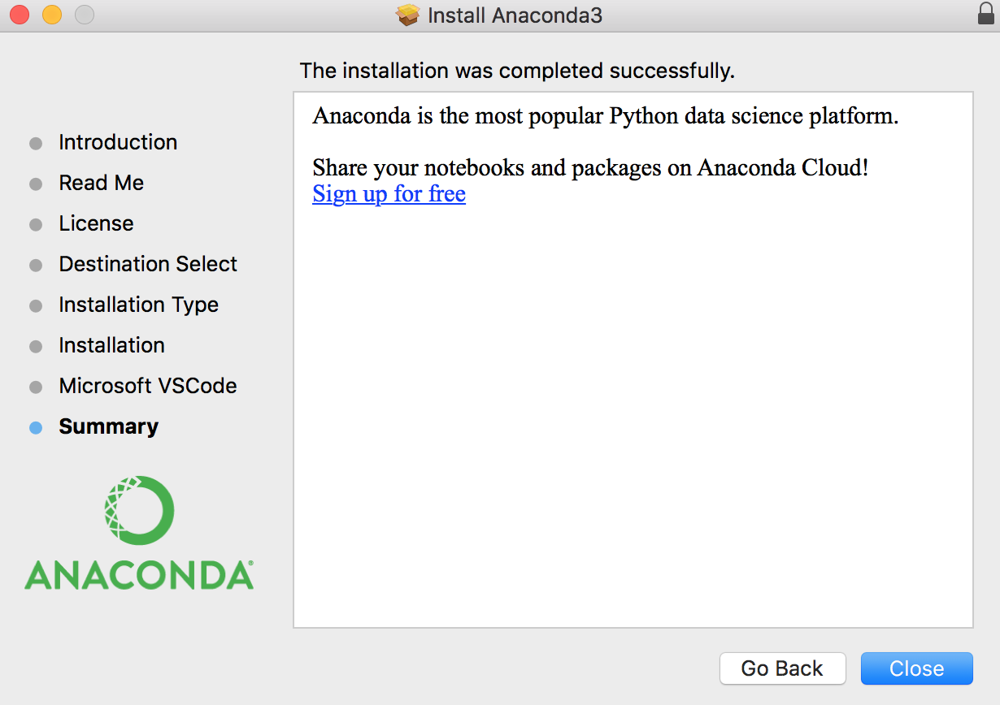
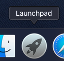
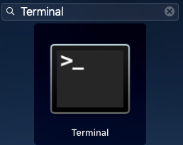
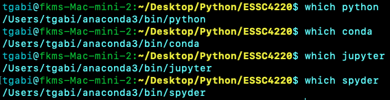

# How to install Anaconda on Mac?

#### Go to https://www.anaconda.com/download/#macos and download Python 3.7 version. (The whole process takes around 30 minutes.)

Anaconda is a popular platform to *Python* (and *R*) data science. It comes with several IDEs (Integrated Development Environments, such as *Jupyter* and *Spyder*) and a package manager `conda` to allow user-friendly coding with *Python*.
<p align="center">
  
</p>

#### You can continue with the default options. The installation takes around 20 minutes. No need to install *Microsoft Visual Studio* at the end. We won't use it in this lab.
<p align="center">
  
</p>

#### A successful installation displays the following screen:
<p align="center">
  
</p>

#### Now use the *terminal* to verify installation and find the path of the required stuffs.
<p align="center">
  
  
</p>

#### Type/copy the following commands into the *terminal* (and press Enter):

```bash
which python conda jupyter spyder
```
As mentioned, `python` is the programming language and `conda` is the package manager. Here, `jupyter` and `spyder` are two IDEs that we will use.

#### You should see a path for each of them, e.g.
<p align="center">
  
</p>

## Install conda environment for extra packages
We will need some extra packages later when we deal with atmospheric data. Follow the guide below to install them into a "conda environment".

Download [environment.txt](https://raw.githubusercontent.com/joeylamcy/Python_tutorial/master/environment.txt) and save it on Desktop. Execute the following command in the *terminal*: 
```bash
conda env create -vv -n earth -f ~/Desktop/environment.txt
```
*Note: Feel free to change earth to other names.*

This will automatically install the relevant packages that you will need in this part and next part. This takes around 5 minutes. Make sure you have **internet connection** while you do this. 

Successful installation gives the following (or something similar):
```
#
# To activate this environment, use
#
#     $ conda activate earth
#
# To deactivate an active environment, use
#
#     $ conda deactivate
```

Next part: [Python Introduction](./Part0_Introduction.md)
