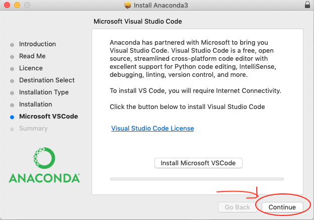
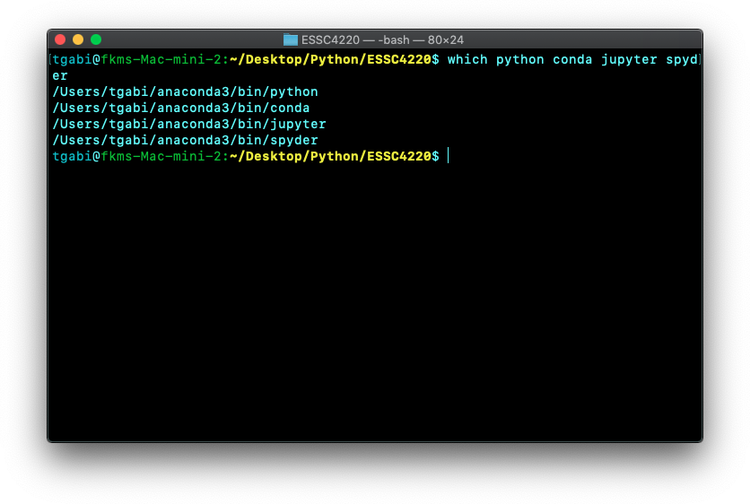

# How to install Anaconda on Mac?

#### Go to https://www.anaconda.com/download/#macos and download Python 3.7 version. (The whole process takes around 20 minutes.)

Anaconda is a popular platform to Python (and R) data science. It comes with several IDEs (Integrated Development Environments, such as Jupyter and Spyder) and a package manager (conda) to allow user-friendly coding with Python.
<p align="center">
  
</p>

#### You can continue with the default options. The installation takes around 10 minutes. No need to install Microsoft Visual Studio at the end. We won't use it in this lab.
<p align="center">
  
</p>

#### A successful installation displays the following screen:
<p align="center">
  
</p>

#### Now use the terminal to verify installation and find the path of the required stuffs.
<p align="center">
  
  
</p>

#### Type/copy the following commands into the terminal (and press Enter):

```bash
which python conda jupyter spyder
```
As mentioned, `python` is the programming language and `conda` is the package manager. Here, `jupyter` and `spyder` are two IDEs that we will use.

#### You should see a path for each of them, e.g.
<p align="center">
  
</p>
